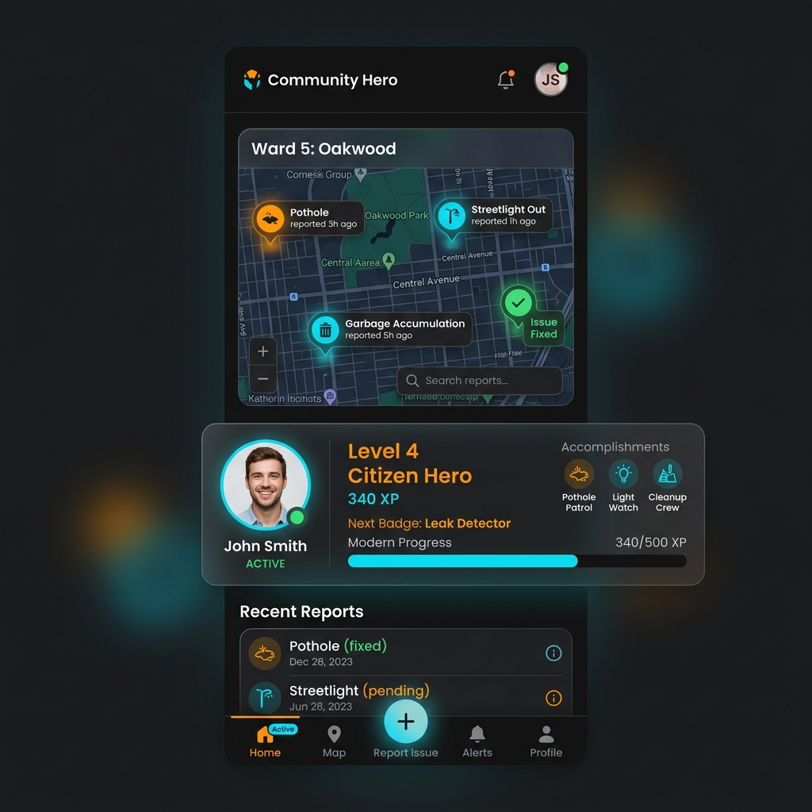
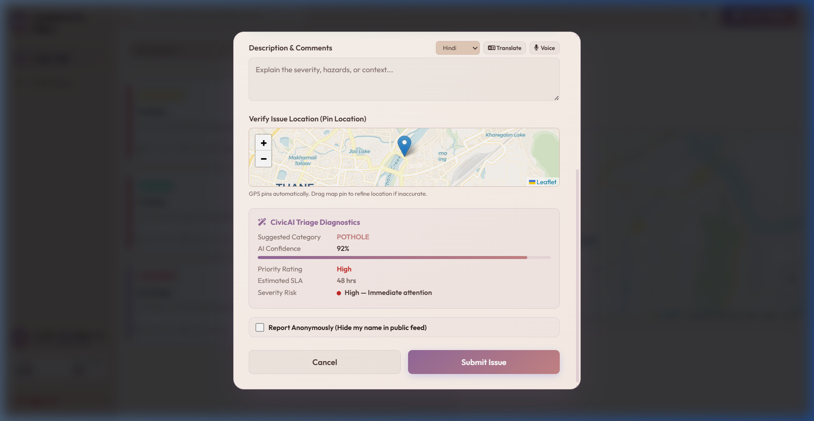
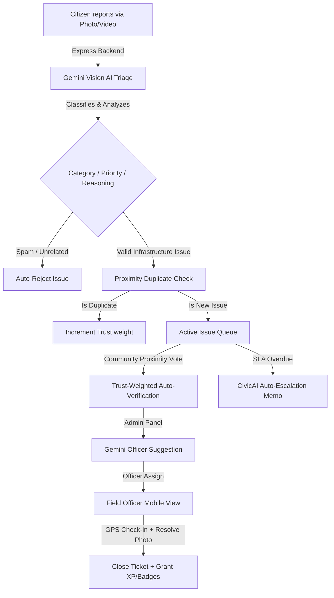

# 🦸‍♂️ Community Hero — Hyperlocal Problem Solver
> *Transforming citizens into civic sensors using an autonomous, trust-weighted platform powered by Google Gemini AI & Google Cloud.*

[](./LICENSE)
[](https://nodejs.org/)
[](https://expressjs.com/)
[](https://aistudio.google.com/)
[](https://cloud.google.com/)
[](https://firebase.google.com/)

🔗 **Live Demo URL:** [https://community-hero-1026415427793.europe-west1.run.app](https://community-hero-1026415427793.europe-west1.run.app)

---

## 📖 Table of Contents
1. [📌 Problem Statement](#-problem-statement)
2. [💡 The Solution](#-the-solution)
3. [🎨 Visual Showcase](#-visual-showcase)
4. [📐 Technical Rationale & Architecture](#-technical-rationale--architecture)
5. [🚀 Key Features](#-key-features)
6. [🛠️ Technology Stack](#️-technology-stack)
7. [💾 Quick Start & Local Setup](#-quick-start--local-setup)
8. [☁️ Google Cloud Deployment Guide](#️-google-cloud-deployment-guide)
9. [🧪 Running Smoke Tests](#-running-smoke-tests)
10. [👥 Demo Accounts & Roles (with Security Disclaimer)](#-demo-accounts--roles)
11. [🎬 3-Minute Hackathon Demo Script](#-3-minute-hackathon-demo-script)
12. [🤖 Gemini API Endpoints Configuration](#-gemini-api-endpoints-configuration)
13. [🔮 Future Roadmap](#-future-roadmap)
14. [📄 License](#-license)

---

## 📌 Problem Statement

In rapidly developing cities, public infrastructure faults (potholes, water leaks, broken streetlights, refuse pile-ups) severely degrade municipal quality of life. Current report channels are fragmented (social media, manual calls) and suffer from:
* **Zero transparency & tracking:** Citizen reports go into a black hole with no progress visibility.
* **Civic spam & duplicate reports:** Multi-reporting of a single high-profile issue clogs the municipal sorting queue.
* **Overwhelmed administrators:** Assigning tasks manual based on field loads and geography takes days, leading to critical SLA breaches.

---

## 💡 The Solution

**Community Hero** is a Progressive Web App (PWA) that acts as an intelligent, real-time, hyperlocal bridge connecting **Citizens**, **Admins**, and **Field Officers**. Using the **Google GenAI SDK** powered by **Google Gemini 2.5 Flash**, it triages evidence automatically, suggests assignments, warns on SLA breaches, and gamifies local civic participation.

---

## 🎨 Visual Showcase

### 📱 Citizen Map & Gamification
The mobile-first PWA dashboard enables citizens to view active reports around them and track their civic contributions.


---

### 🧠 CivicAI Visual Triage
Gemini Vision automatically analyzes uploaded reports, flags duplicates, categorizes issues, and reasons out safety priorities.


---

### 🏢 Admin Command Center & AI Forecast
The administrative command center lists real-time ward analytics, visual SLA graphs, and Gemini-powered operations recommendations.


---

## 📐 Technical Rationale & Architecture

Our stack was carefully engineered to balance client-side responsiveness, real-time sync, and intelligent agentic decision-making:
* **Gemini 2.5 Flash via Google AI Studio:** Provides exceptionally low latency and high accuracy in multimodal image parsing. This replaces custom, heavy computer vision pipelines with one API call that does categorization, severity scoring, and reasoning.
* **Proximity Trust-Weighting:** Resolves civic duplicates before databases are populated by checking reports within a 500-meter radius, drastically reducing manual verification costs.
* **Firebase Firestore (Real-Time Sync):** Enables immediate bi-directional updates. A citizen sees status timeline progression instantly as the field officer checks in or resolves the ticket.

### 🖼️ Architecture Flow Diagram



---

## 🚀 Key Features

* **🧠 Smart AI Triage (Gemini 2.5 Flash):** Classifies reports instantly into categories, filters out selfies or spam, and details its reasoning.
* **📍 Trust-Weighted Verification:** Nearby citizens (validated within 500m via GPS) verify issues. Reaching target weight triggers auto-verification.
* **🎖️ Civic Gamification:** Citizens earn XP, unlock custom badges, maintain streaks, and climb the public leaderboard for civic contributions.
* **⚡ Real-time Synchronization:** Powered by Firestore (or local fallback) to update officer assignments and citizen status maps in real-time.
* **🚨 Agentic SLA Escalation:** CivicAI periodically monitors overdue tickets and auto-generates structured escalation memos for administration heads.
* **🌍 Translation Engine:** Automatically translates reports and status messages to **Hindi (हिन्दी)**, **Kannada (ಕನ್ನಡ)**, and **Tamil (தமிழ்)** using Gemini.

---

## 🛠️ Technology Stack

| Layer | Technology Used | Purpose |
|---|---|---|
| **Frontend** | Vanilla JS + Leaflet Maps + ChartJS | Compact, interactive, responsive map-centric dashboard. |
| **Backend** | Node.js (ESM) + Express.js | Core API engine hosting REST endpoints. |
| **AI Integration** | `@google/genai` (Gemini 2.5 Flash) | Image classification, translation, trend analysis, and memos. |
| **Edge Fallback** | MobileNet v2 (TensorFlow.js) | Local, on-device image classification when offline/no API key. |
| **Database** | Firebase Firestore | Real-time multi-device database synchronization. |
| **Deployment** | Google Cloud Run / App Engine | Scalable serverless cloud environments. |

---

## 💾 Quick Start & Local Setup

### 1. Clone & Install
```bash
# Clone the repository
git clone https://github.com/krishna-vishwakarma/community-hero.git
cd community-hero

# Install dependencies
npm install
```

### 2. Configure Environment
Create a `.env` file in the root directory:
```env
PORT=3000

# Get your Gemini API Key from Google AI Studio: https://aistudio.google.com/apikey
GEMINI_API_KEY=your_google_ai_studio_api_key
```

### 3. Run Locally
```bash
# Start server
npm start
```
Open your browser and navigate to `http://localhost:3000`.

*Relative links to main deployment files:*
* [Dockerfile](./Dockerfile) — Containerized deployment specifications.
* [app.yaml](./app.yaml) — App Engine configuration parameters.
* [firebase-config.js](./firebase-config.js) — Firebase connection config.

---

## ☁️ Google Cloud Deployment Guide

We have pre-configured [Dockerfile](./Dockerfile) and [app.yaml](./app.yaml) configurations to deploy to Google Cloud.

### Option A: Google Cloud Run (Recommended Containerized)
Google Cloud Run runs your application containerized. You can build the container image either locally (using Docker) or directly in the cloud (using Google Cloud Build, which does not require Docker installed on your machine).

#### Method 1: Cloud-Based Containerization (No local Docker required)
1. Open [Google Cloud Shell](https://shell.cloud.google.com).
2. Clone your repository:
   ```bash
   git clone https://github.com/krishna-vishwakarma/community-hero.git && cd community-hero
   ```
3. Submit the build to **Google Cloud Build** and deploy it to **Cloud Run** in a single step (Google Cloud will build the Docker image using the provided [Dockerfile](./Dockerfile) in the cloud):
   ```bash
   gcloud run deploy community-hero \
     --source . \
     --allow-unauthenticated \
     --set-env-vars="GEMINI_API_KEY=your_google_ai_studio_api_key"
   ```

#### Method 2: Local Containerization (Requires local Docker installation)
If you have Docker installed on your local development machine, you can build and run the image locally:
1. Build the Docker image containing both the Express backend and static frontend assets:
   ```bash
   docker build -t community-hero .
   ```
2. Run the container locally:
   ```bash
   docker run -p 3000:3000 --env GEMINI_API_KEY="your_google_ai_studio_api_key" community-hero
   ```
3. Push to Google Artifact Registry to deploy:
   ```bash
   docker tag community-hero gcr.io/your_gcp_project_id/community-hero
   docker push gcr.io/your_gcp_project_id/community-hero
   ```


### Option B: Google App Engine (Standard)
Deploy directly using:
```bash
gcloud app deploy
```
Make sure to configure the `GEMINI_API_KEY` under the app settings in the GCP Console.

---

## 🧪 Running Smoke Tests
A comprehensive test suite is included to validate the server routes and GenAI payloads.
```bash
npm test
```

---

## 👥 Demo Accounts & Roles

> [!WARNING]
> **Security Disclaimer:** The following credentials are mock developer profiles pre-seeded with static mock database profiles. They are intended strictly for hackathon evaluation and local reviews. No real, sensitive, or personal data is collected or stored.

To test the multi-role collaboration workflow, use the following credentials:

| Role | Email | Password | Description |
|---|---|---|---|
| **Citizen** | `krishna@civic.com` | `citizen123` | Report issues with images, vote on nearby issues, track XP. |
| **Field Officer** | `ramesh@civic.com` | `officer123` | Check-in via GPS at assigned sites, upload proof, resolve. |
| **Admin** | `sarah@civic.com` | `admin123` | Manage live map queue, get AI trend reports, view SLA breach logs. |

---

## 🎬 3-Minute Hackathon Demo Script

Follow these steps for a perfect end-to-end live demo:

1. **Citizen View (Triage & Gamification)**
   * Log in as `krishna@civic.com`.
   * Click **Report Issue** and upload a photo (e.g. pothole).
   * Observe **Gemini Vision AI** instantly classify the issue, assign severity, write a description, and output its visual reasoning.
2. **Community Verification**
   * View the map. Click on nearby issues.
   * If you are within `500m`, the **Verify** button becomes active. Confirm the issue to increase its trust-weight.
3. **Admin Dashboard (Analytics & suggestions)**
   * Log in as `sarah@civic.com`.
   * Open the admin dashboard to see live SLA timelines and ward analytics.
   * Click **AI City Ops Forecast** to fetch real-time recommendations generated by Gemini.
   * Open the ticket and click **AI Officer Suggestion** to find the most suitable field worker based on distance and load. Assign it.
4. **Field Officer (Resolution)**
   * Log in as `ramesh@civic.com`.
   * Check **My Assignments**, click on the task, check in at the coordinate, upload a "resolved" picture, and close it.
5. **Transparency & Public Share**
   * Copy the public share link. Open the link in an incognito window (`?issue=ID&public=1`). The public can view the resolution timeline without logging in.

---

## 🤖 Gemini API Endpoints Configuration

| Endpoint | Method | Input Parameters | Output Payload | Description |
|---|---|---|---|---|
| `/api/classify` | `POST` | `{ imageBase64 }` | `{ category, confidence, priority, reasoning }` | Parses image data to categorize infrastructure issues. |
| `/api/suggest-assignment` | `POST` | `{ issue, officers, officerLoads }` | `{ officerId, reason, confidence }` | Finds the best match officer. |
| `/api/escalate` | `POST` | `{ issue, overdueHours }` | `{ memo, issueId }` | Auto-generates administrative SLA reports. |
| `/api/trends` | `POST` | `{ issues, wards }` | `{ summary, forecast, recommendation }` | Generates city health insights. |
| `/api/translate` | `POST` | `{ text, targetLang }` | `{ translated, targetLang }` | Multi-language translation. |

---

## 🔮 Future Roadmap

* **🚨 IoT Infrastructure Integration:** Connect smart streetlights to automatically trigger tickets when lamps flicker, bypassing manual reporting.
* **🎙️ Voice-to-Report Accessibility:** Enable multi-lingual voice messages which are parsed via Gemini's Audio API into text reports for disabled or elderly users.
* **📈 Autonomous Budget Allocation:** Let CivicAI aggregate ward issue patterns to suggest budget distributions to wards needing critical road repairs.
* **📲 WhatsApp Chatbot Integration:** Citizens submit reports and images directly via WhatsApp Business API, making reporting accessible without installing PWAs.

---

## 📄 License
This project is licensed under the MIT License — see the [LICENSE](./LICENSE) file for details. Built for the Google AI Studio & Google Cloud Hackathon.

