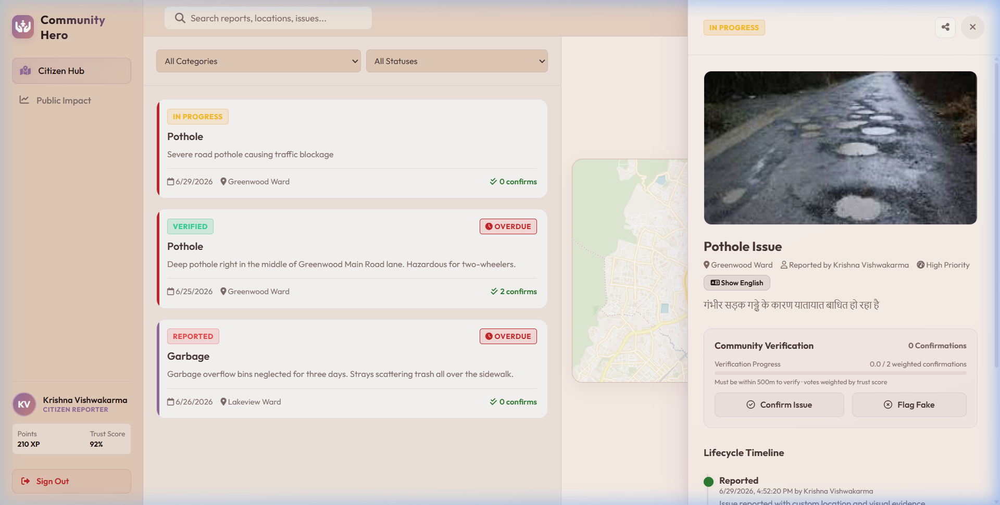
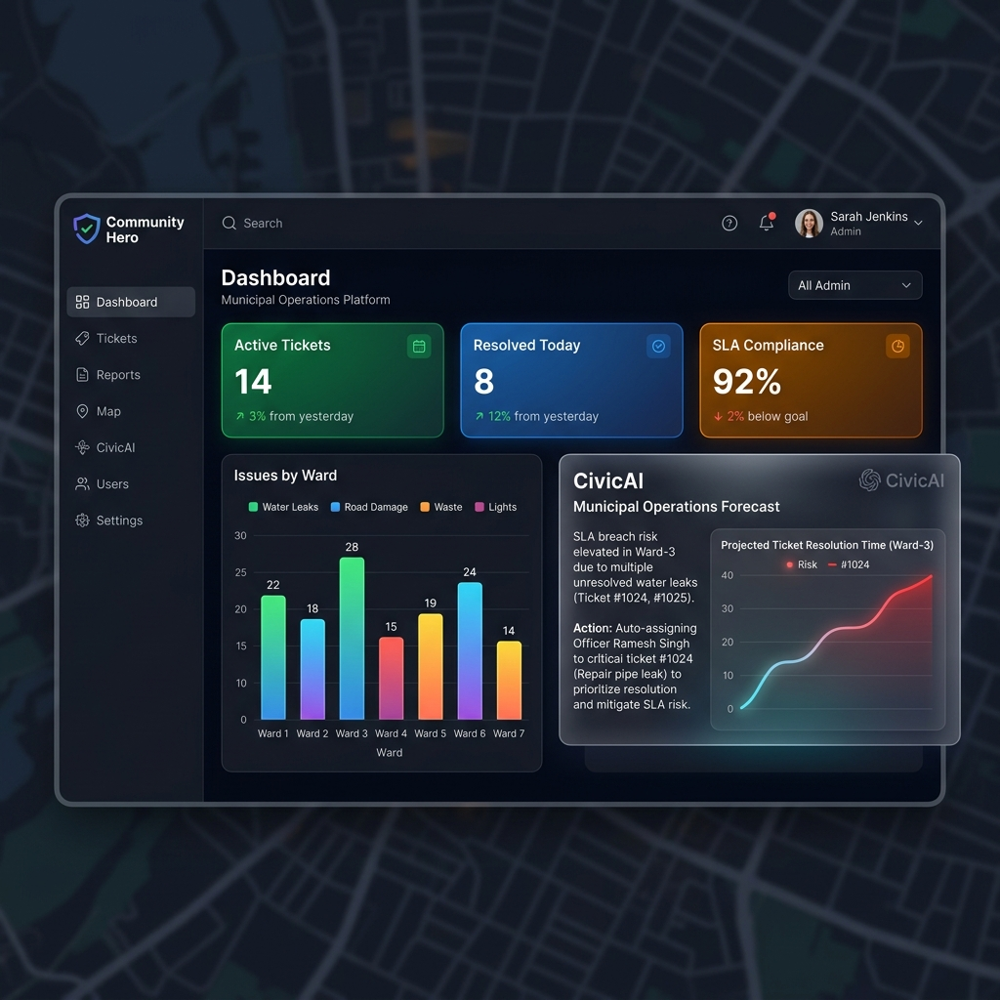
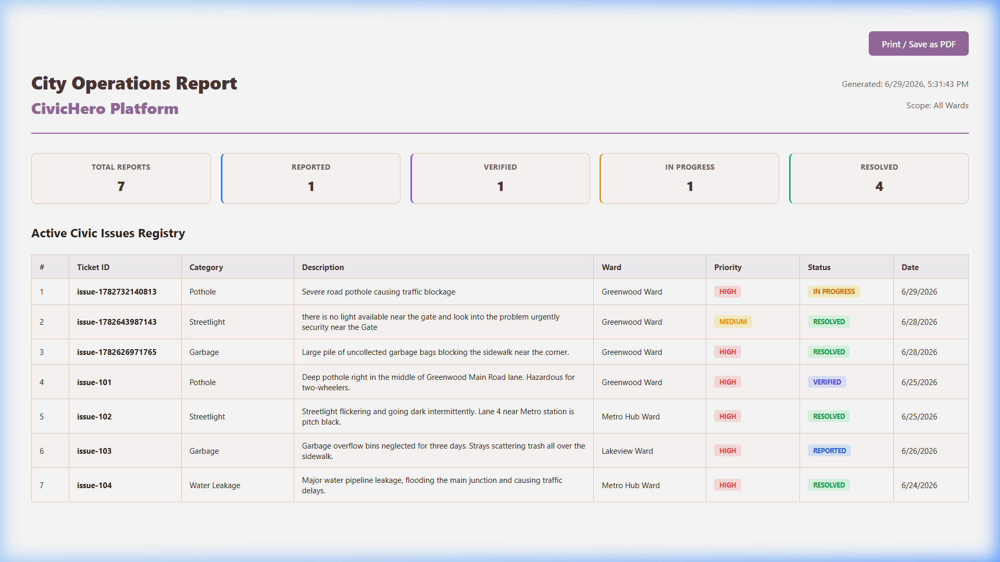

# 🦸‍♂️ Community Hero — Hyperlocal Problem Solver
> *Transforming citizens into civic sensors using an autonomous, trust-weighted platform powered by Google Gemini AI & Google Cloud.*

[](./LICENSE)
[](https://nodejs.org/)
[](https://expressjs.com/)
[](https://aistudio.google.com/)
[](https://cloud.google.com/)
[](https://firebase.google.com/)

🔗 **Live Demo URL:** [https://community-hero-1026415427793.europe-west1.run.app](https://community-hero-1026415427793.europe-west1.run.app)

---

## 📖 Table of Contents
1. [📌 Problem Statement](#-problem-statement)
2. [💡 The Solution](#-the-solution)
3. [🎬 Live Video Walkthrough](#-live-video-walkthrough)
4. [🎨 Visual Showcase (Actual Screenshots)](#-visual-showcase-actual-screenshots)
5. [🚀 Key Features Breakdown](#-key-features-breakdown)
6. [🛠️ Technology Stack](#️-technology-stack)
7. [💾 Quick Start & Local Setup](#-quick-start--local-setup)
8. [☁️ Google Cloud Deployment Guide](#️-google-cloud-deployment-guide)
9. [🧪 Running Smoke Tests](#-running-smoke-tests)
10. [👥 Demo Accounts & Roles](#-demo-accounts--roles)
11. [🤖 Gemini API Endpoints Configuration](#-gemini-api-endpoints-configuration)
12. [📄 License](#-license)

---

## 📌 Problem Statement

In rapidly developing municipal areas, public infrastructure faults (dangerous potholes, leaking water mains, broken streetlights, refuse pile-ups) degrade local safety and quality of life. Traditional report mechanisms suffer from:
* **Zero transparency & tracking:** Citizens submit reports into a administrative "black hole" with no visual updates.
* **Civic spam & duplicate tickets:** Hundreds of users submit individual reports for a single high-profile issue, clogging sorting databases.
* **Administrative bottleneck:** Operators manually analyze, classify, prioritize, and assign tickets based on field load, taking days.

---

## 💡 The Solution

**Community Hero** is a Progressive Web App (PWA) that acts as an intelligent, real-time, hyperlocal bridge connecting **Citizens**, **Municipal Administrators**, and **Field Officers**. Powered by **Google Gemini 2.5 Flash** and **Google Cloud Run**, it triages visual evidence automatically, prevents duplicate tickets using geofencing, calculates trust-weighted local verifications, suggests field staff assignments, and generates SLA reports.

---

## 🎬 Live Video Walkthrough

Watch a full end-to-end interactive demo of the application including Citizen Reporting, AI Visual Triage, Admin Command Operations, and Field Officer check-ins:


---

### 🌍 Real-Time Translation (Hindi / Kannada / Tamil)
Citizens can translate descriptions and timeline updates to their native language with one-click, using context-aware Gemini translations.


---

### 🏢 Admin Command Dashboard & AI Metrics
The operational view provides admins with weekly SLA trends, classification charts, and live predictive operations insights.


---

### 📋 Exportable PDF Operations Reports
Admins can generate and print clean, professional PDF reports of the operational queue for municipal records and staff meetings.


---

## 🚀 Key Features Breakdown

### 1. 🧠 Multimodal AI Visual Triage (Gemini 2.5 Flash)
- When a citizen uploads an image of a fault, the backend passes it to the Gemini vision model.
- The model automatically extracts the **Category** (pothole, streetlight, garbage, water leakage), flags **Spam/Unrelated** images, computes **Severity** (Low, Medium, High, Critical), explains the **Reasoning**, and suggests a concise report title.

### 2. 🎙️ Voice Dictation Dictator (Web Speech API)
- Citizens who cannot easily type can use the **Voice Input** button on the report form.
- It uses the browser's native Speech Recognition API to transcribe speech in real-time. If microphone access is blocked, it offers a typing simulation overlay so the feature remains testable.

### 3. 🌍 Multi-lingual Translation API
- Fully translates report details and officer timelines between English, Hindi (हिन्दी), Kannada (ಕನ್ನಡ), and Tamil (தமிழ்).
- Uses Gemini on the backend to translate contextually, rather than simple literal word-for-word translation.

### 4. 📍 Geofenced Anti-Duplication
- Before creating a new ticket, the platform evaluates coordinates. If an issue of the same category exists within a **60-meter radius**, the system prompts the user to verify/confirm the existing issue instead of creating a duplicate.

### 5. 🗳️ Proximity-Weighted Verification
- To bypass manual city inspector visits, local citizens can "verify" other reports.
- **Rule**: Must be within **500 meters** of the issue coordinates (validated via GPS).
- The upvote weight is scaled by the citizen's **Trust Score**. Reaching a weighted threshold (2.0) automatically shifts the issue status from "Reported" to "Verified".

### 6. 🎖️ Civic Gamification
- Citizens earn XP, unlock badges (*Local Watchdog*, *Daily Guardian*), and maintain active daily login streaks to incentivize community support.

### 7. 🏢 Admin Console & Predictive AI Insights
- **SLA Breach Warnings**: Tracks SLA deadlines and highlights overdue tasks.
- **AI Operational Forecast**: Computes local Hotspot zones, top recurring issues, and forecasts tickets at risk of SLA breaching.
- **AI Assignment Recommender**: Recommends the best Field Officer to handle a ticket based on geographical proximity and current task load.

### 8. 🛵 Officer GPS Check-In
- Field officers must be within **200 meters** of the assigned issue coordinates to check in. This logs their physical arrival in the issue timeline and allows them to update/resolve the ticket.

### 9. ⚡ Offline local storage & Sync
- Built as a Progressive Web App (PWA). If internet is lost, it saves all reports to `localStorage` and syncs them to Firestore automatically once connection is restored.

---

## 🛠️ Technology Stack

| Layer | Technology Used | Purpose |
|---|---|---|
| **Frontend UI** | HTML5 + CSS3 (Glassmorphism theme) + Vanilla ES6 JS | Lightweight, interactive viewport styling. |
| **Interactive Mapping** | Leaflet.js (Voyager Tiles API) | Visual coordinate map pins and geofence tracking. |
| **Analytics Charts** | Chart.js | Renders dynamic line and pie graphs on the Admin console. |
| **API Backend** | Node.js + Express.js | Exposes backend API endpoints. |
| **AI Processing** | `@google/genai` (Gemini 2.5 Flash) | Image triage, translation, officer suggestions, and escalation. |
| **Database Sync** | Firebase Firestore + LocalStorage fallback | Bi-directional real-time data synchronization. |
| **Deployment** | Google Cloud Run + Cloud Build | Managed serverless hosting with automated CI/CD. |

---

## 💾 Quick Start & Local Setup

### 1. Clone & Install
```bash
git clone https://github.com/Krishna-v03/community-hero.git
cd community-hero
npm install
```

### 2. Configure Environment
Create a `.env` file in the root directory:
```env
PORT=3000

# Get your Gemini API Key from Google AI Studio: https://aistudio.google.com/apikey
GEMINI_API_KEY=your_gemini_api_key_here
```

### 3. Run Locally
```bash
npm start
```
Navigate to `http://localhost:3000` in your web browser.

---

## ☁️ Google Cloud Deployment Guide

We utilize a **Dockerfile** based build deployed on **Google Cloud Run** for serverless hosting.

### Continuous Deployment via GitHub (Automated CI/CD)
The project is set up with automated CI/CD:
1. Every commit pushed to the `main` branch of your GitHub repository triggers a **Google Cloud Build** webhook.
2. Cloud Build builds the container image using [Dockerfile](./Dockerfile) and registers it in **Artifact Registry**.
3. It performs a zero-downtime rolling update to your **Cloud Run** service.

*Note: Environment variables like `GEMINI_API_KEY` are securely injected into the Cloud Run service variables dashboard in the Google Cloud Console, preventing them from being exposed in public code files.*

---

## 🧪 Running Smoke Tests
Run the Express endpoint integration tests using:
```bash
npm test
```

---

## 👥 Demo Accounts & Roles

To test the workflows, click on the **Quick-Fill chips** at the bottom of the login screen:

| Role | Email | Password | Features to Test |
|---|---|---|---|
| **Citizen** | `krishna@civic.com` | `citizen123` | Report with photo/voice, translate cards to Hindi, verify nearby issues. |
| **Field Officer** | `ramesh@civic.com` | `officer123` | Check-in at issue coordinates via GPS, view assigned work orders. |
| **Admin** | `sarah@civic.com` | `admin123` | View SLA analytics, get AI predictions, assign tasks, export PDF/CSV queues. |

---

## 🤖 Gemini API Endpoints Configuration

Exposed backend routes communicating with the `gemini-2.5-flash` model:

| Endpoint | Method | Input Parameters | Output Payload | Description |
|---|---|---|---|---|
| `/api/classify` | `POST` | `{ imageBase64 }` | `{ category, isSpam, severity, reasoning, title, description }` | Uses Gemini Vision to triage images and filter out spam. |
| `/api/suggest-assignment` | `POST` | `{ issue, officers, officerLoads }` | `{ officerId, confidence, reason }` | Computes the most suitable officer to assign. |
| `/api/translate` | `POST` | `{ text, targetLang }` | `{ translated, targetLang }` | Language translation (Hindi/Tamil/Kannada/English). |
| `/api/escalate` | `POST` | `{ issue, overdueHours }` | `{ memo }` | Generates escalation memos for overdue tickets. |

---

## 📄 License
This project is licensed under the MIT License — see the [LICENSE](./LICENSE) file for details.
